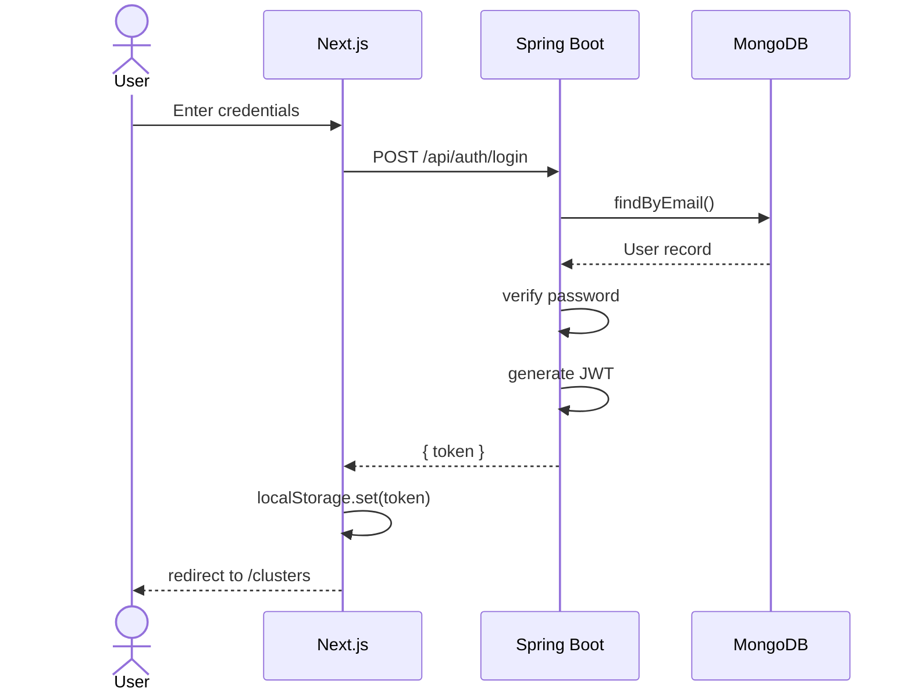
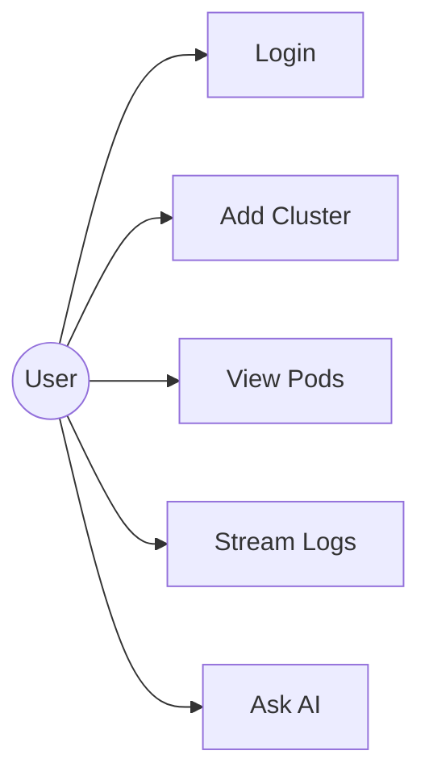

# Architecture Diagrams

Bu klasör, K8s Observer projesinin mimari diyagramlarını içerir. Tüm diyagramlar [Mermaid](https://mermaid.js.org/) syntax'ı ile yazılmıştır — text-based olduğu için sürüm kontrolüne uygun, her yerde render edilebilir.

## Dosyalar

| Dosya | İçerik | Kullanım |
|---|---|---|
| `class-diagram.mmd` | Backend sınıf yapısı | Tek diyagram, kopyalanabilir kaynak |
| `component-diagram.mmd` | Sistem bileşen haritası | Tek diyagram, kopyalanabilir kaynak |
| `diagrams.md` | İkisi birden + dökümantasyon | GitHub otomatik render eder |
| `diagrams.html` | Live preview | Tarayıcıda aç, canlı render |
| `README.md` | Bu dosya | — |

## Hızlı Başlangıç

### Görüntüleme

**Tarayıcıda canlı:**
```bash
# diagrams.html'i aç
open diagrams.html        # macOS
xdg-open diagrams.html    # Linux
start diagrams.html       # Windows
```

**GitHub'da:**
`diagrams.md` dosyasını repo'ya push et, GitHub otomatik render eder.

**Online editor:**
[mermaid.live](https://mermaid.live) — `.mmd` dosyasının içeriğini kopyala, yapıştır.

### Düzenleme

#### IntelliJ IDEA
1. `Settings` → `Plugins` → "Mermaid" ara → kur
2. `.mmd` dosyasını aç → sağda canlı preview

#### VS Code
1. Extensions → "Markdown Preview Mermaid Support" kur
2. `.md` dosyasını aç → Cmd+Shift+V preview

#### CLI (Export)
PNG/SVG export için Mermaid CLI:
```bash
npm install -g @mermaid-js/mermaid-cli

# PNG
mmdc -i class-diagram.mmd -o class-diagram.png

# SVG
mmdc -i class-diagram.mmd -o class-diagram.svg

# Özel tema
mmdc -i class-diagram.mmd -o class-diagram.png -t dark
```

## Mermaid Syntax — Hızlı Referans

### Class Diagram

```
classDiagram
    class MyClass {
        -privateField: Type
        +publicMethod() ReturnType
        #protectedMethod()
    }

    class Interface {
        <<interface>>
        +method()
    }

    %% Relationships
    ClassA --> ClassB               : uses (dependency)
    ClassA ..|> Interface           : implements (realization)
    ClassA --|> ParentClass         : extends (inheritance)
    ClassA *-- ClassB               : composition (owns)
    ClassA o-- ClassB               : aggregation (has)
    ClassA "1" --> "many" ClassB    : with multiplicity
```

### Flowchart / Component Diagram

```
graph TB
    A[Square Box]
    B(Round Box)
    C{Diamond}
    D((Circle))
    E[(Database)]

    A --> B              : solid arrow
    A -.-> B             : dotted arrow
    A ==> B              : thick arrow
    A -->|label| B       : labeled arrow
    A <-.-> B            : bidirectional

    subgraph Group["Group Label"]
        X
        Y
    end

    classDef styleName fill:#COLOR,stroke:#COLOR,stroke-width:2px
    class A,B styleName
```

### Yön (Direction)

- `graph TB` — Top to Bottom
- `graph LR` — Left to Right
- `graph BT` — Bottom to Top
- `graph RL` — Right to Left

## Yeni Diyagram Ekleme

### Sequence Diagram (örneğin "Login akışı")



### Use Case Diagram



## İpuçları

### Büyük diyagramları böl
Tek diyagramda 30+ class olursa karışır. Domain başına ayrı diyagram yap:
- `auth-module.mmd`
- `kubernetes-module.mmd`
- `ai-module.mmd`

### Tema değiştirme
`%%{init: {'theme': 'dark'}}%%` satırını diyagramın en başına ekle. Seçenekler:
- `default`, `dark`, `forest`, `neutral`, `base`

### Custom styling
```mermaid
%%{init: {'themeVariables': {'primaryColor': '#ff6b6b'}}}%%
```

## Sık Karşılaşılan Sorunlar

**Diyagram render olmuyor**
- Syntax hatası — [mermaid.live](https://mermaid.live)'de test et, hata mesajını görürsün

**GitHub'da görünmüyor**
- Dosya uzantısı `.md` olmalı, `.mmd` değil
- Kod bloğu `mermaid` ile etiketli olmalı: ` ```mermaid ... ``` `

**IntelliJ preview kayboldu**
- Plugin güncel mi kontrol et, IDE'yi yeniden başlat

## Kaynaklar

- [Mermaid Official Docs](https://mermaid.js.org/)
- [Mermaid Live Editor](https://mermaid.live)
- [Mermaid Cheat Sheet](https://jojozhuang.github.io/tutorial/mermaid-cheat-sheet/)
- [VS Code Mermaid Preview](https://marketplace.visualstudio.com/items?itemName=bierner.markdown-mermaid)
- [IntelliJ Mermaid Plugin](https://plugins.jetbrains.com/plugin/20146-mermaid)
