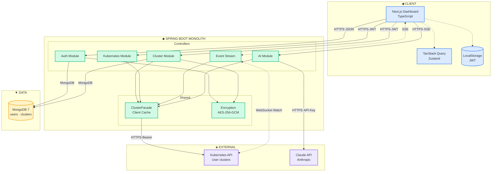

# K8s Observer · Architecture Diagrams

Bu dosyada projenin UML diyagramları [Mermaid](https://mermaid.js.org/) syntax'ı ile yazılmıştır. GitHub bu dosyayı otomatik render eder. Düzenlemek için doğrudan aşağıdaki kod bloklarını değiştir.

> **Nasıl düzenlerim?**
> - **IntelliJ:** `Mermaid` plugin'ini kur, `.mmd` dosyalarını açarken canlı preview gelir
> - **VS Code:** `Markdown Preview Mermaid Support` extension'ı
> - **Online:** [mermaid.live](https://mermaid.live) — kopyala-yapıştır, düzenle, export et
> - **Lokal:** `diagrams.html` dosyasını tarayıcıda aç

---

## 1. Class Diagram — Backend Hexagonal Structure

Backend'in sınıfları, servisleri, port-adapter ilişkileri.

```mermaid
classDiagram
    %% ─── Controllers ───
    class AuthController {
        +register(req) JwtResponse
        +login(req) JwtResponse
    }
    class ClusterController {
        +list(user) List~ClusterDTO~
        +create(req, user) ClusterDTO
    }
    class PodController {
        +list(clusterId, ns) List~PodDTO~
        +streamLogs(...) SseEmitter
    }
    class NodeController {
        +list(clusterId) List~NodeDTO~
    }
    class EventStreamController {
        +subscribe(clusterId) SseEmitter
    }
    class AIController {
        +analyzeLogs(req) SseEmitter
        +chat(msg, ctx) String
    }

    %% ─── Services ───
    class AuthService {
        +register(req) JwtResponse
        +login(req) JwtResponse
    }
    class ClusterService {
        +create(req, userId) Cluster
        +listByOwner(userId) List
    }
    class PodService {
        +getPods(user, clusterId, ns)
        +streamLogs(user, clusterId, ...)
    }
    class NodeService {
        +getNodes(user, clusterId)
    }
    class AIService {
        +analyzeLogs(req)
        +chat(msg, ctx) String
    }
    class PodWatchManager {
        -watches: Map~UUID, Watch~
        -subscribers: Map~UUID, List~
        +subscribe(clusterId) SseEmitter
    }
    class ClusterAuthService {
        +assertOwnership(user, id)
    }
    class ClusterFacade {
        -clientCache: ConcurrentMap
        +getClient(clusterId) Client
    }
    class EncryptionService {
        +encrypt(plaintext) String
        +decrypt(ciphertext) String
    }

    %% ─── Ports (interfaces) ───
    class KubernetesPort {
        <<interface>>
        +listPods(clusterId, ns) List
        +streamLogs(...) LogStream
        +watchPods(clusterId, handler) Watch
    }
    class AIPort {
        <<interface>>
        +analyze(prompt, context) String
        +toolUse(msg, tools) Response
    }
    class ClusterRepository {
        <<interface>>
        +save(cluster) Cluster
        +findByIdAndOwner(id, ownerId)
    }
    class UserRepository {
        <<interface>>
        +findByEmail(email) Optional
    }

    %% ─── Entities ───
    class User {
        -id: UUID
        -email: String
        -passwordHash: String
    }
    class Cluster {
        -id: UUID
        -ownerId: UUID
        -name: String
        -encryptedKubeconfig: String
    }
    class Pod {
        -name: String
        -namespace: String
        -status: PodStatus
    }
    class Node {
        -name: String
        -status: NodeStatus
    }

    %% ─── Adapters ───
    class Fabric8KubernetesAdapter
    class AnthropicAIAdapter
    class MongoClusterRepository
    class MongoUserRepository
    class JwtService

    %% Relationships — Controllers → Services
    AuthController --> AuthService
    ClusterController --> ClusterService
    PodController --> PodService
    NodeController --> NodeService
    EventStreamController --> PodWatchManager
    AIController --> AIService

    %% Services → Ports
    AuthService --> UserRepository
    AuthService --> JwtService
    ClusterService --> ClusterRepository
    ClusterService --> EncryptionService
    ClusterService --> ClusterFacade
    PodService --> KubernetesPort
    PodService --> ClusterAuthService
    NodeService --> KubernetesPort
    AIService --> AIPort
    AIService --> KubernetesPort
    PodWatchManager --> KubernetesPort
    ClusterAuthService --> ClusterRepository
    ClusterFacade --> ClusterRepository

    %% Adapters implement Ports
    Fabric8KubernetesAdapter ..|> KubernetesPort
    AnthropicAIAdapter ..|> AIPort
    MongoClusterRepository ..|> ClusterRepository
    MongoUserRepository ..|> UserRepository

    Fabric8KubernetesAdapter --> ClusterFacade

    %% Entities
    Cluster "many" --> "1" User : owned by
```



**Okuma kılavuzu:**
- **Solid arrow (`-->`)** → "uses" — bir sınıf diğerini kullanır/dependency
- **Dashed arrow with triangle (`..|>`)** → "implements" — adapter port'u gerçekliyor
- **`<<interface>>`** → Port'lar, Hexagonal'daki abstraction noktaları

---

## 2. Component Diagram — System Overview

Sistemdeki tüm bileşenler ve aralarındaki iletişim.



**Okuma kılavuzu:**
- **Solid arrow (`-->`)** → request-response
- **Dashed arrow (`<-.->`)** → persistent connection (SSE, WebSocket)
- Her arrow üzerindeki label protocol'ü gösterir

---

## Diyagramları Düzenleme

### Sınıf eklemek
```
class YeniSinif {
    -field: Type
    +method() ReturnType
}
```

### İlişki eklemek
```
AClass --> BClass              : "uses"
AClass ..|> InterfaceX         : "implements"
AClass "1" --> "many" BClass   : "composition with multiplicity"
AClass o-- BClass              : "aggregation"
AClass *-- BClass              : "composition (strong)"
```

### Bileşen eklemek (component diagram)
```
subgraph NewGroup["Group Label"]
    NewComponent["Component Name<br/>Technology"]
end
NewComponent --> ExistingComponent
```

### Renk değiştirmek
Dosya sonundaki `classDef` satırlarında hex kodları değiştir:
```
classDef myStyle fill:#HEX,stroke:#HEX,stroke-width:2px
class ComponentA,ComponentB myStyle
```

---

## Faydalı Linkler

- [Mermaid Syntax — Class Diagram](https://mermaid.js.org/syntax/classDiagram.html)
- [Mermaid Syntax — Flowchart/Component](https://mermaid.js.org/syntax/flowchart.html)
- [mermaid.live Editor](https://mermaid.live) — anlık düzenleme
- [Awesome Mermaid](https://github.com/mermaid-js/awesome-mermaid) — örnekler
